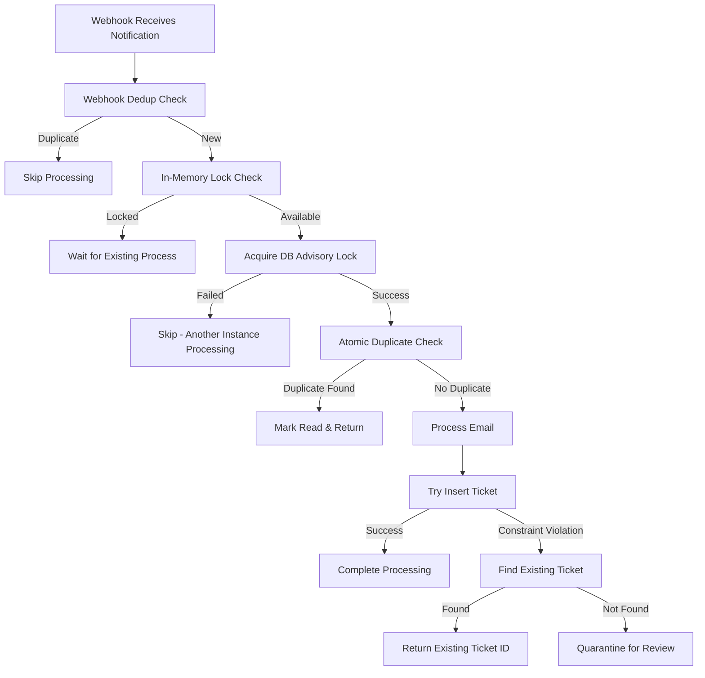

# Duplicate Email Processing Fix

## Problem Summary

The ticket system was experiencing duplicate key constraint violations when processing emails, specifically:

```
PostgresError: duplicate key value violates unique constraint "tickets_external_message_id_unique"
```

### Root Cause

1. **Microsoft Graph webhook race conditions**: Microsoft Graph sends duplicate notifications for the same email
2. **Concurrent processing**: Multiple webhook calls process the same email simultaneously
3. **Race condition in duplicate detection**: Both processes pass the duplicate check before either completes
4. **Database constraint violation**: Second process tries to insert duplicate `external_message_id`

## Solution Implemented

### 1. Multi-Layer Duplicate Prevention

#### Layer 1: Webhook-Level Deduplication
- **Location**: `src/app/api/webhook/graph-notifications/route.ts`
- **Mechanism**: In-memory map tracking recently processed message IDs
- **Window**: 60-second deduplication window
- **Purpose**: Prevent processing same message ID multiple times

```typescript
const recentlyProcessedMessages = new Map<string, number>();
const DEDUP_WINDOW_MS = 60000; // 1 minute window
```

#### Layer 2: In-Memory Processing Locks
- **Location**: `src/lib/emailProcessor.ts`
- **Mechanism**: Promise-based locks per `internetMessageId`
- **Purpose**: Prevent concurrent processing of same email content

```typescript
const processingLocks = new Map<string, Promise<ProcessEmailResult>>();
```

#### Layer 3: Database Advisory Locks
- **Location**: `src/lib/emailProcessor.ts`
- **Mechanism**: PostgreSQL advisory locks using hashed `internetMessageId`
- **Purpose**: Cross-instance protection against concurrent processing

```sql
SELECT pg_try_advisory_lock(hash_value)
```

#### Layer 4: Enhanced Atomic Duplicate Detection
- **Location**: `src/lib/emailProcessor.ts`
- **Mechanism**: Simultaneous check across tickets, comments, and quarantine tables
- **Purpose**: Comprehensive duplicate detection before processing

#### Layer 5: Graceful Constraint Violation Handling
- **Location**: `src/lib/emailProcessor.ts`
- **Mechanism**: Try-catch around ticket insertion with fallback logic
- **Purpose**: Handle rare cases where duplicates still occur

### 2. Enhanced Error Handling

#### Constraint Violation Recovery
```typescript
try {
    [newTicket] = await db.insert(tickets).values(ticketData).returning({ id: tickets.id });
} catch (insertError: any) {
    if (insertError.code === '23505' && insertError.constraint_name === 'tickets_external_message_id_unique') {
        // Find existing ticket and treat as successful
        const existingTicket = await db.query.tickets.findFirst({ /* ... */ });
        return { success: true, ticketId: existingTicket.id, skipped: true };
    }
}
```

#### Quarantine Fallback
- If constraint violation occurs without finding existing record, email is quarantined
- Prevents data loss while allowing manual review

### 3. Processing Flow



## Configuration

### Environment Variables

```bash
# Webhook deduplication (optional)
WEBHOOK_MAX_CONCURRENT=3                    # Max concurrent email processing
WEBHOOK_PROCESSING_TIMEOUT=10000           # Processing timeout in ms
WEBHOOK_ENABLE_QUICK_FILTERING=true        # Enable pre-filtering

# Database connection (ensure good pool size)
DATABASE_URL=postgresql://...
DATABASE_MAX_CONNECTIONS=20                # Adequate for concurrent processing
```

## Monitoring & Alerts

### Key Metrics to Monitor

1. **Duplicate Detection Rate**
   ```sql
   -- Check how often duplicates are caught
   SELECT 
       COUNT(*) as duplicate_catches,
       DATE_TRUNC('hour', created_at) as hour
   FROM logs 
   WHERE message LIKE '%duplicate%' 
   GROUP BY hour;
   ```

2. **Constraint Violations**
   ```sql
   -- Should be near zero after fix
   SELECT COUNT(*) FROM logs 
   WHERE message LIKE '%duplicate key value violates%'
   AND created_at > NOW() - INTERVAL '24 hours';
   ```

3. **Processing Lock Failures**
   ```bash
   # Monitor logs for lock acquisition failures
   grep "Failed to acquire processing lock" /var/log/app.log
   ```

### Alert Conditions

- **High**: Any constraint violations (should be extremely rare)
- **Medium**: High rate of duplicate detections (may indicate webhook issues)
- **Low**: Processing lock failures (normal under high load)

## Testing

### Unit Tests

Test the duplicate detection logic:

```typescript
describe('Email Duplicate Detection', () => {
  it('should detect duplicate tickets', async () => {
    // Test atomic duplicate check
  });
  
  it('should handle constraint violations gracefully', async () => {
    // Test constraint violation recovery
  });
});
```

### Load Testing

Simulate concurrent webhook processing:

```typescript
// Send multiple identical webhook notifications simultaneously
const promises = Array(10).fill(null).map(() => 
  fetch('/api/webhook/graph-notifications', {
    method: 'POST',
    body: JSON.stringify(sameEmailNotification)
  })
);
```

## Performance Impact

### Expected Improvements

1. **Reduced errors**: Near-zero constraint violations
2. **Better throughput**: Less failed processing and retries
3. **Cleaner logs**: Fewer error alerts and quarantine events

### Potential Overhead

1. **Memory usage**: Small increase for processing locks and dedup maps
2. **Database locks**: Brief advisory locks (automatically released)
3. **Processing time**: Minimal increase for duplicate checks

## Maintenance

### Lock Cleanup

Processing locks are automatically cleaned up, but monitor for:

- Memory leaks in `processingLocks` map
- Orphaned advisory locks (very rare)

### Performance Tuning

Adjust timeouts based on email processing patterns:

```typescript
const DEDUP_WINDOW_MS = 60000; // Increase if emails process slowly
const PROCESSING_TIMEOUT = 10000; // Increase for complex emails
```

## Rollback Plan

If issues arise, you can disable layers gradually:

1. **Disable webhook deduplication**: Set `WEBHOOK_ENABLE_QUICK_FILTERING=false`
2. **Disable advisory locks**: Comment out lock acquisition in `emailProcessor.ts`
3. **Full rollback**: Revert to previous `emailProcessor.ts` version

## Future Improvements

1. **Metrics dashboard**: Track duplicate rates and processing times
2. **Intelligent deduplication**: Machine learning to predict duplicates
3. **Distributed locks**: Redis-based locks for multi-instance deployments
4. **Event sourcing**: Track all email processing events for better debugging 